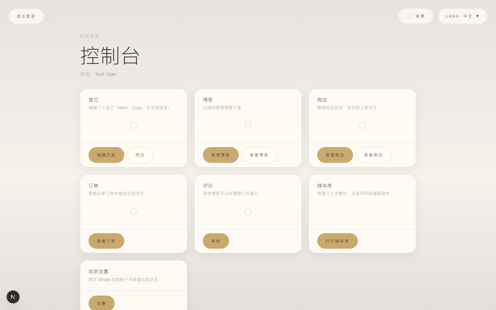
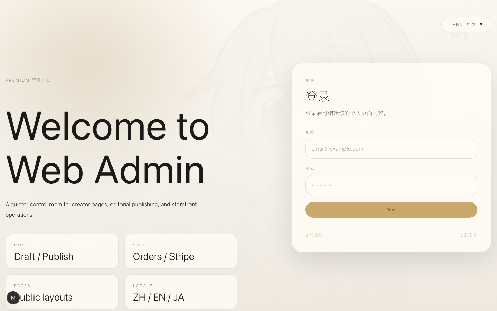
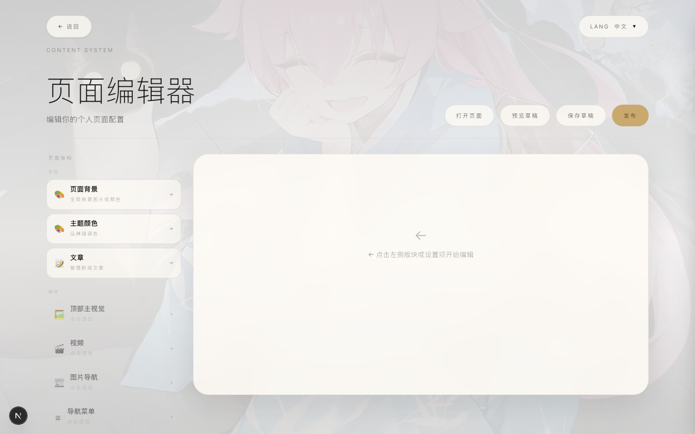
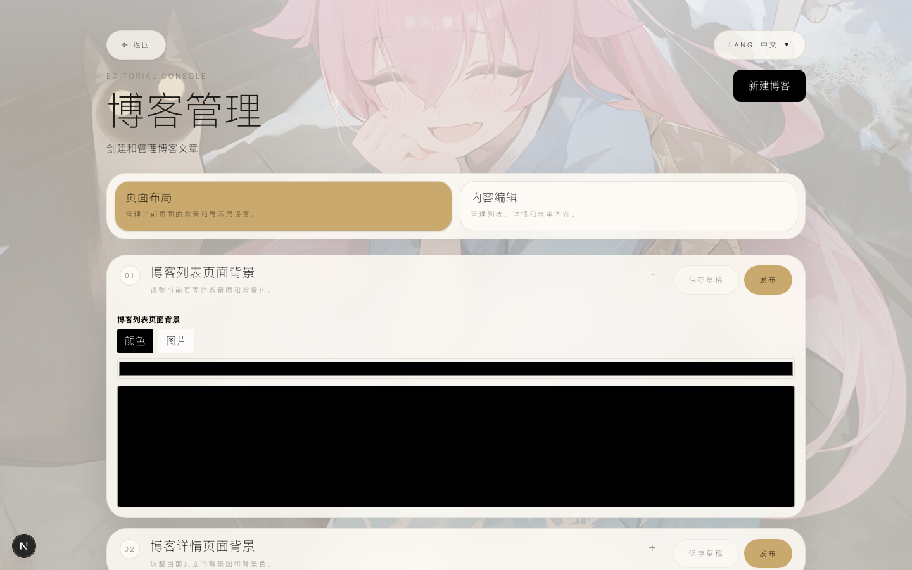
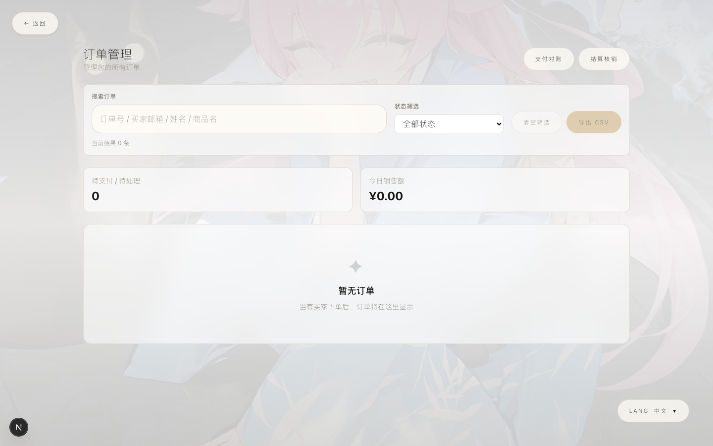
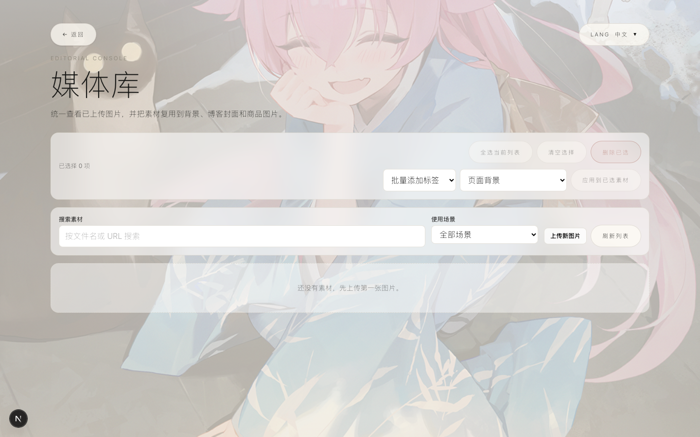
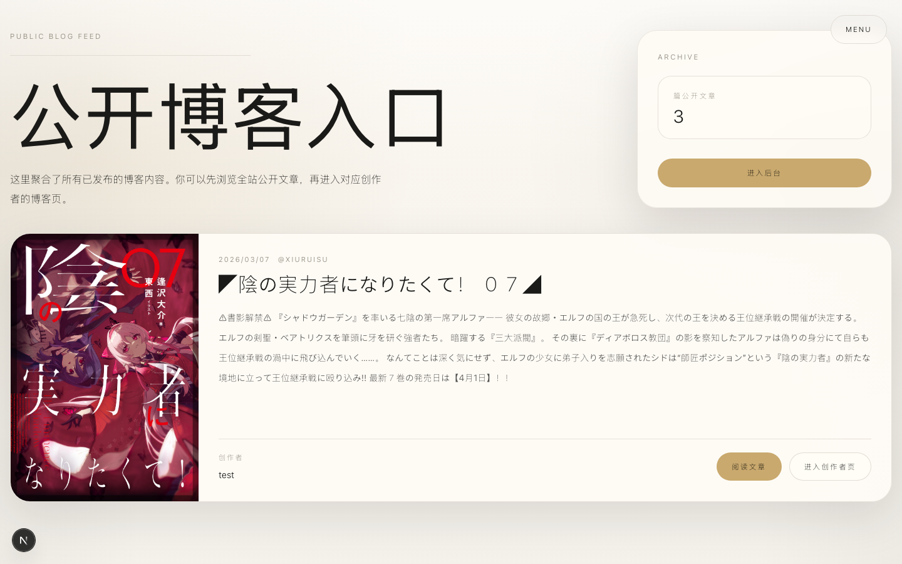
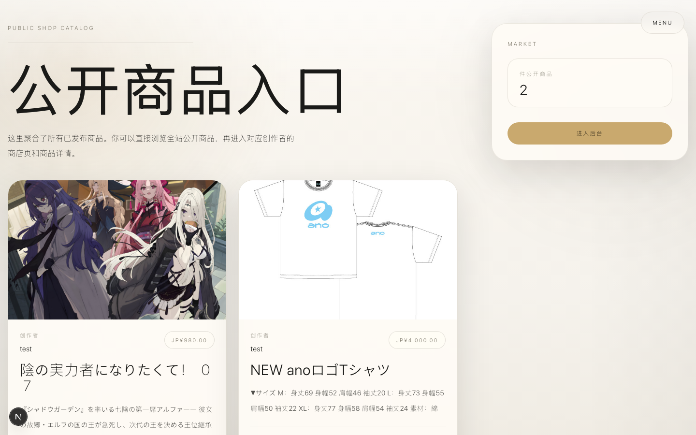

# v-module-frontend

[](https://github.com/anteisuba/v-module-frontend/actions/workflows/ci.yml)

A multi-tenant creator site system for VTubers and content creators. Each user gets a customizable public page, a CMS back-office, blog, news, storefront, and order management — all powered by a single Next.js application.

## Preview

### Public Creator Page


### Admin Dashboard



<details>
<summary>More screenshots</summary>

#### Login



#### CMS Page Editor



#### Blog Management



#### Shop Management


#### Order Management



#### Media Library



#### Public Blog



#### Public Shop



</details>

## Features

- **Creator Pages** — Config-driven public pages (`/u/[slug]`) with Hero, news carousel, video, social links, and theme customization
- **CMS** — Draft / publish workflow with per-section editors (background, theme color, Hero, video, gallery, navigation)
- **Blog** — Post editor, public listing, likes, comments with moderation (pending / approved / rejected)
- **News** — Article management with public listing and detail pages
- **Shop** — Product catalog, public storefront, Stripe Checkout integration
- **Orders** — Seller dashboard with search, status filters, CSV export, refunds, and dispute tracking
- **Payments** — Stripe Checkout, Webhooks, Connect (seller onboarding, destination charges, payouts), reconciliation, and settlement
- **Media Library** — Unified asset management with reference tracking, batch tagging, and in-place replacement
- **i18n** — Chinese, Japanese, and English via `next-intl`

## Tech Stack

| Layer | Technology |
|---|---|
| Framework | Next.js 16 (App Router, Turbopack) + React 19 |
| Language | TypeScript 5 |
| Database | PostgreSQL + Prisma ORM |
| Auth | iron-session |
| Validation | Zod |
| Payments | Stripe (Checkout, Connect, Webhooks) |
| i18n | next-intl |
| Email | Resend / SMTP |
| Storage | Local filesystem or Cloudflare R2 |
| Testing | Vitest (111 tests) + Playwright (11 e2e specs, 3-browser matrix) |
| CI/CD | GitHub Actions + Vercel |

## Getting Started

**Prerequisites:** Node.js >= 22, pnpm >= 10, Docker (for PostgreSQL)

```bash
# 1. Start PostgreSQL
docker compose up -d

# 2. Configure environment
cp env.example .env
# Edit .env with your DATABASE_URL, Stripe keys, etc.

# 3. Install & setup
pnpm install
pnpm db:migrate
pnpm db:seed

# 4. Run
pnpm dev
```

Open [http://localhost:3000](http://localhost:3000). Seed account: `test@example.com` / `123456`.

## Project Structure

```
app/              Next.js pages & API routes
  admin/          Back-office (dashboard, CMS, blog, shop, orders, media, comments)
  api/            REST endpoints (user, page, blog, news, shop, payments, media)
  u/[slug]/       Public creator page
features/         Feature-level UI components (hero, blog, shop, page renderer)
domain/           Business services, types, and queries
components/       Shared UI and editor components
lib/              Session, env, context, API clients, utilities
prisma/           Schema, migrations, seed
i18n/             Locale files (zh, ja, en)
tests/            Vitest unit tests + Playwright e2e
docs/             Project documentation (zh-CN, ja)
```

## Documentation

- [Full documentation](./docs/README.md)
- [Project overview (zh-CN)](./docs/zh-CN/overview/project-overview.md)
- [Current status (zh-CN)](./docs/zh-CN/overview/current-status.md)
- [Setup & commands (zh-CN)](./docs/zh-CN/development/setup-and-commands.md)
- [Backlog (zh-CN)](./docs/zh-CN/overview/backlog.md)
